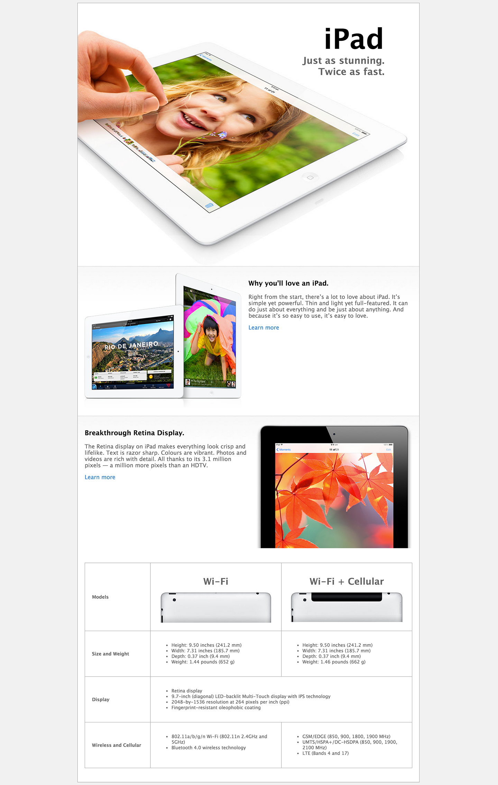

# Recreate Apple landing page with CSS

### Instructions
- Fork and clone repo
- `cd` into directory
- create a css stylesheet (`style.css`) and add a link tag to it in `index.html`
- open `index.html` in your browser
- Add in css properties in `style.css` to make index.html look so:

